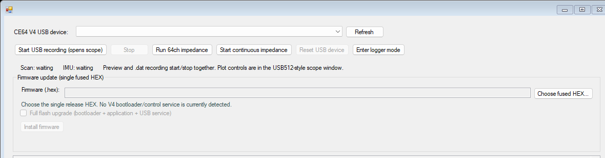

# USB Mode

WILD Console provides a dedicated **USB** tab for the CE64 V4 resident USB service. This wired mode supports lossless 64-channel electrophysiology and IMU capture, impedance checks, device handoff, and firmware installation from the same fused release HEX used by the other update paths.

USB mode is separate from normal microSD logging. Connecting VBUS does not select USB mode automatically, and master/follower negotiation does not enter it.

!!! note "Supported GUI operations"
    This page documents controls that are exposed by the current WILD Console USB tab: 64-channel/5 kHz ephys plus IMU recording, one-shot and continuous impedance, reset, return to logger mode, and firmware installation. Do not assume camera streaming or physical-SD browsing is available unless those controls appear in the installed Console release.

## Before You Start

- Install a WILD Console release that includes the **USB** tab.
- Use a CE64 image containing Bootloader V4 and the resident USB service.
- Select the fused HEX matching both the hardware revision (**HW1** or **HW2**) and role (**Auto**, **Master**, or **Slave**).
- Use a USB cable with working data lines, not a charge-only cable.
- Stop local recording, BLE preview, USB recording, and impedance measurement before switching mode or installing firmware.
- Install STM32CubeProgrammer before using **Full flash upgrade**. Normal USB acquisition does not require it.

## Enter USB Mode

1. Start WILD Console and connect to the logger on the **Online** tab.
2. Stop any active recording or preview.
3. Open **Advanced** and issue the resident USB-service command. In WILD Console 3.4.2.144, the shared control is labelled **Enable CE128 USB ephys**; it is the V4 resident-service handoff used by compatible WILD/CE64 images.
4. Confirm the prompt. The BLE connection closes while the device resets into the USB service; this is expected.
5. Open the **USB** tab, connect the USB data cable, and click **Refresh**.
6. Select the CRC-validated CE64/WILD64 device from **CE64 V4 USB device**.

If the logger is already running the resident USB service, begin at step 5.

{ .wild-readable-figure }

## USB Tab Controls

| Control | Operation |
| --- | --- |
| **Refresh** | Re-enumerates compatible CE64/WILD64 USB devices. Use it after any reset or mode change. |
| **Start USB recording (opens scope)** | Starts the 64-channel, 5 kHz ephys stream and IMU capture, opens the live scope, and records both streams to the PC. |
| **Stop** | Stops the USB stream and closes the output files. Use this before disconnecting USB. |
| **Run 64ch impedance** | Runs one verified impedance sweep and opens the 64-channel result map. |
| **Start continuous impedance** | Repeats verified sweeps until stopped. It cannot run at the same time as USB recording. |
| **Reset USB device** | Requests a CRC-validated idle reset. The device disconnects and re-enumerates. |
| **Enter logger mode** | Exits the resident USB service and starts the normal SD-recording application. |
| **Choose fused HEX...** | Selects and validates the single release HEX used for either application-only or full-flash installation. |
| **Full flash upgrade** | Includes the bootloader, application, and resident USB service. Reserve this for bootloader upgrades or recovery. |

## Record Ephys and IMU to the PC

1. Select the CE64 V4 USB device.
2. Click **Start USB recording (opens scope)**.
3. Choose a parent output folder.
4. WILD Console creates a timestamped `CE64_USB_YYYYMMDD_HHMMSS` folder containing:
   - `amplifier.dat` for 64-channel, 5 kHz electrophysiology.
   - `imu.dat` for IMU frames.
5. Use the separate scope window for live channel inspection.
6. Confirm that the USB status continues to report a lossless stream.
7. Click **Stop** before closing the Console or unplugging the logger.

The Console stops the stream if a lossless counter becomes non-zero. Treat such a run as failed and resolve the USB/storage or host-performance problem before collecting experimental data.

## Measure Impedance

USB recording and impedance measurement are mutually exclusive.

1. Stop USB recording if it is active.
2. Click **Run 64ch impedance** for a single sweep, or **Start continuous impedance** for repeated sweeps.
3. Review the channel map in the impedance report window.
4. Stop continuous impedance before starting USB recording, updating firmware, resetting, or returning to logger mode.

## Return to Normal Logger Mode

1. Stop USB recording and all impedance activity.
2. Click **Enter logger mode**.
3. Confirm the prompt.
4. Expect the USB device to disconnect while the normal BLE/SD-recording application starts.

Entering logger mode is the correct way to leave the resident USB service. Reconnecting the cable alone does not select a different mode.

## Install Firmware from One Fused HEX

The public update artifact is one sparse fused `.hex`. WILD Console validates its application manifest, vectors, application CRC, and manifest CRC before enabling installation.

### Normal application update

Use this path when the CE64 V4 device is detected in the USB tab.

1. Stop USB recording and impedance activity.
2. Click **Choose fused HEX...** and select the correct HW/role release image.
3. Leave **Full flash upgrade** unchecked.
4. Click **Install firmware** and accept the application-update prompt.
5. The Console extracts and writes only the validated application and manifest. The bootloader, preserved configuration, and resident USB service remain unchanged.
6. Wait for programming and verification to finish, then click **Refresh** after USB re-enumerates.

The application manifest is committed last so an interrupted application update is not accepted as a valid image.

### Full flash upgrade or recovery

!!! danger "Do not interrupt a full-flash upgrade"
    Losing power or USB during full-flash programming can leave the device unbootable and require SWD recovery. Use stable bench power and do not move the cable.

Use full flash only when installing a new bootloader/resident service or recovering a target that cannot perform a normal V4 application update.

1. Install STM32CubeProgrammer on the PC.
2. Click **Choose fused HEX...** and select a complete V4 fused release HEX.
3. Select **Full flash upgrade (bootloader + application + USB service)**.
4. Click **Install firmware** and read the warning carefully.
5. If a V4 device is selected, the Console requests STM32 ROM DFU automatically. Otherwise, place the target in ROM DFU before continuing.
6. Keep power and USB connected until programming, verification, reset, and re-enumeration complete.

The preserved configuration sector is not contained in the fused HEX and is not overwritten by this operation.

## Troubleshooting

| Symptom | Check |
| --- | --- |
| No device appears | Confirm the device entered V4 USB service, use a data-capable cable, wait for Windows enumeration, then click **Refresh**. Close other applications that may hold the physical disk. |
| Recording or impedance buttons are disabled | Select a compatible, CRC-validated device. Refresh after a reset or mode change. |
| BLE disappears after requesting USB mode | Expected: the normal logger application has handed control to the resident USB service. |
| Normal install is disabled | A V4 bootloader/control service was not detected. Reconnect the V4 service, or use full flash only with a complete fused HEX and the target in ROM DFU. |
| USB recording stops by itself | Check the status/log for non-zero lossless counters. Do not use the partial run as validated data. |
| Device does not return to BLE logging | Stop active USB operations, use **Enter logger mode**, and wait for the normal application to boot. |

